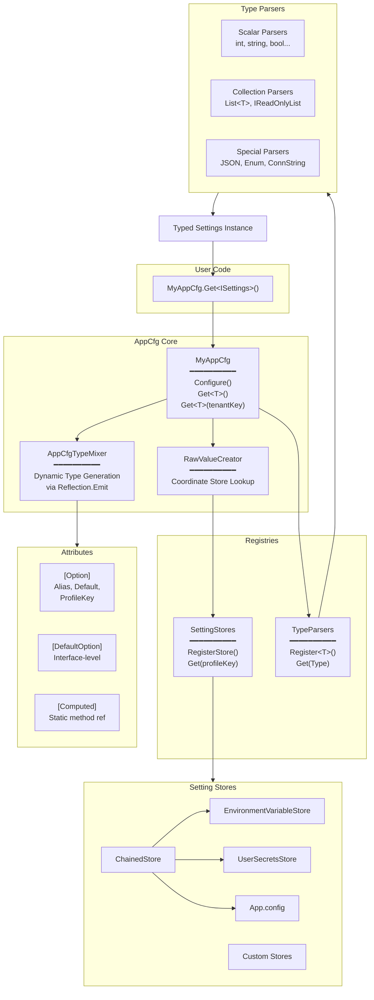
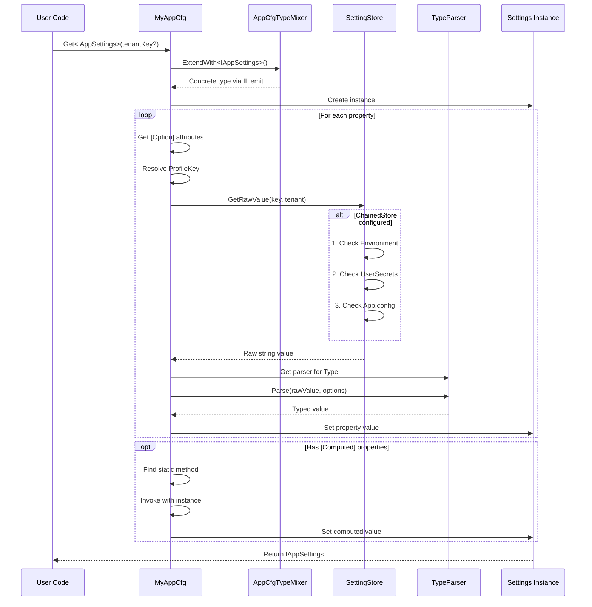
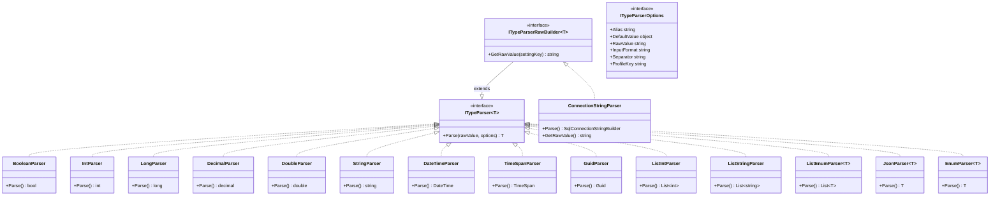
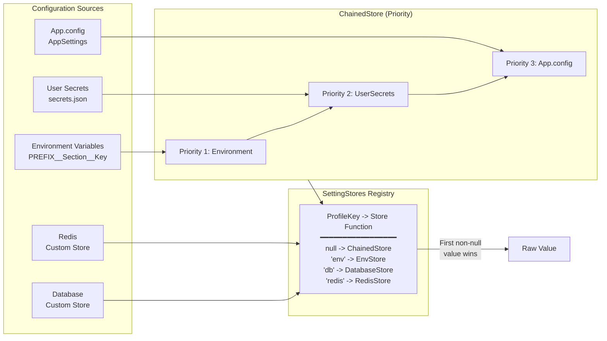
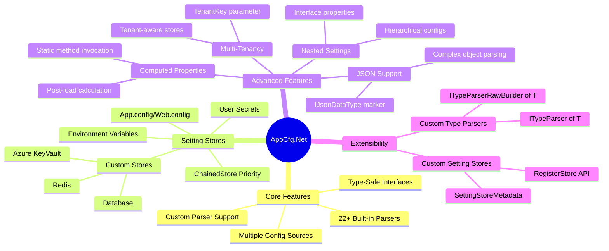
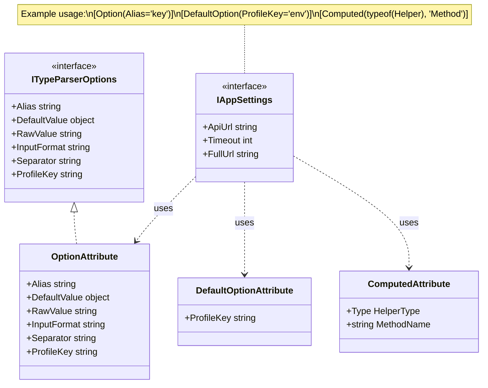
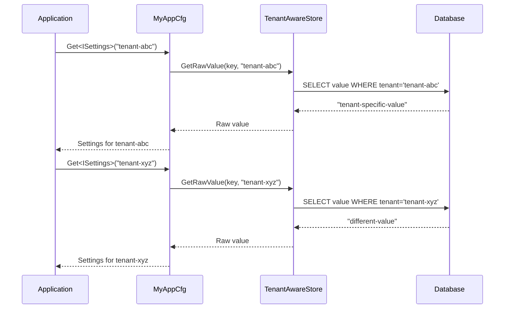
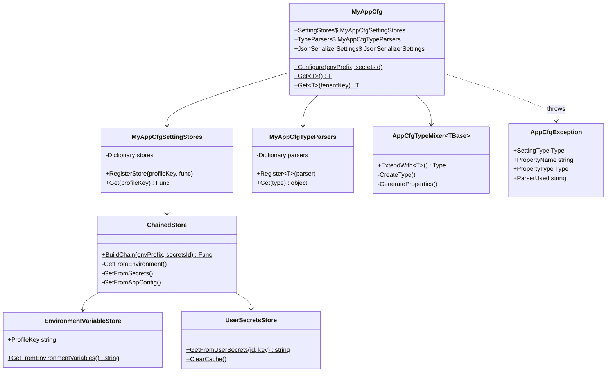

# AppCfg.Net Architecture

This document provides visual diagrams of the AppCfg.Net configuration library architecture using Mermaid syntax.

## Table of Contents

1. [System Architecture Overview](#1-system-architecture-overview)
2. [Configuration Data Flow](#2-configuration-data-flow)
3. [Type Parser Hierarchy](#3-type-parser-hierarchy)
4. [Setting Store System](#4-setting-store-system)
5. [Feature Overview](#5-feature-overview)
6. [Attribute System](#6-attribute-system)
7. [Multi-Tenancy Flow](#7-multi-tenancy-flow)
8. [Complete Class Diagram](#8-complete-class-diagram)

---

## 1. System Architecture Overview



---

## 2. Configuration Data Flow



---

## 3. Type Parser Hierarchy



---

## 4. Setting Store System



---

## 5. Feature Overview



---

## 6. Attribute System



---

## 7. Multi-Tenancy Flow



---

## 8. Complete Class Diagram



---

## Key Components Summary

| Component | Purpose |
|-----------|---------|
| `MyAppCfg` | Main entry point - Configure() and Get<T>() methods |
| `AppCfgTypeMixer` | Dynamic type generation via Reflection.Emit |
| `ITypeParser<T>` | Interface for parsing string values to typed values |
| `ISettingStore` | Interface for configuration sources |
| `ChainedStore` | Priority-based configuration (Env > Secrets > App.config) |
| `OptionAttribute` | Per-property configuration (alias, default, profile) |
| `DefaultOptionAttribute` | Interface-level default ProfileKey |
| `ComputedAttribute` | Calculated properties via static methods |

---

## Rendering These Diagrams

These diagrams can be rendered in:

- **GitHub/GitLab** - Automatic rendering in markdown
- **VS Code** - With Markdown Preview Mermaid Support extension
- **Mermaid Live Editor** - https://mermaid.live (export to PNG/SVG)
- **Notion, Obsidian, Confluence** - Built-in support

To export via CLI:
```bash
npm install -g @mermaid-js/mermaid-cli
mmdc -i ARCHITECTURE.md -o architecture.png
```
